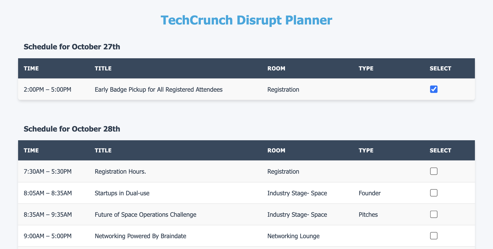

# Planer for TechCrunch Disrupt 2024
I will be going to TC Disrupt for the first time this year and wanted to plan in advance which talks to attend.

This app was build in about 90 minutes using Cursor, so it might have some bugs.




## Installation
Clone the repository and run
```
python server.py
```
then navigate to localhost:5000.

## Usage
Select all interesting events and they will show up at the buttom under "Selected Events". Once you're done, export them to your calender using the "Download Calendar" button.

## Future plans
The small little planner already makes life a lot easier but optimally we could just ask a language model that knows us  which talks to attend and it would return a plan. Unfortunately, the current agenda seems to be too long for the input token maximum of the LLMs that I have tried.
